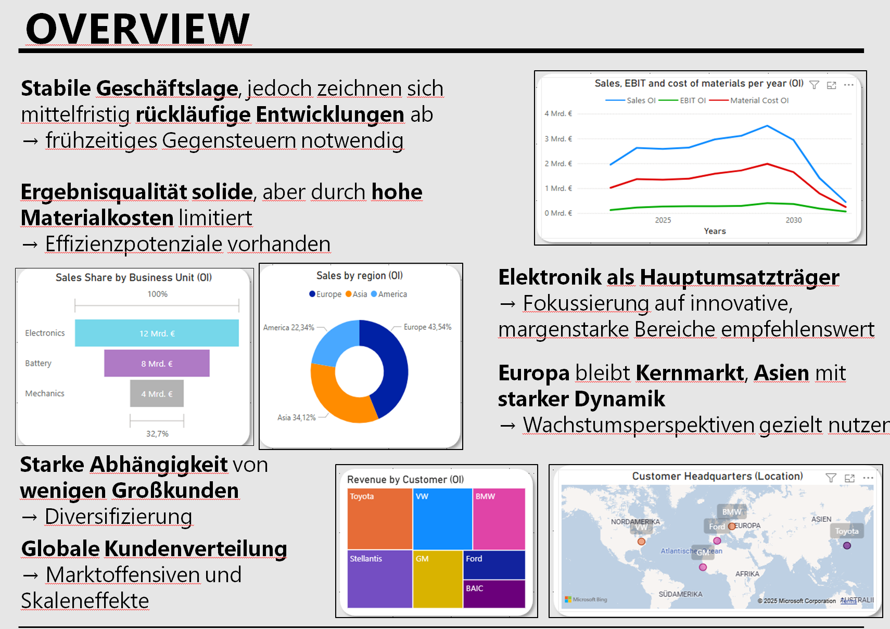
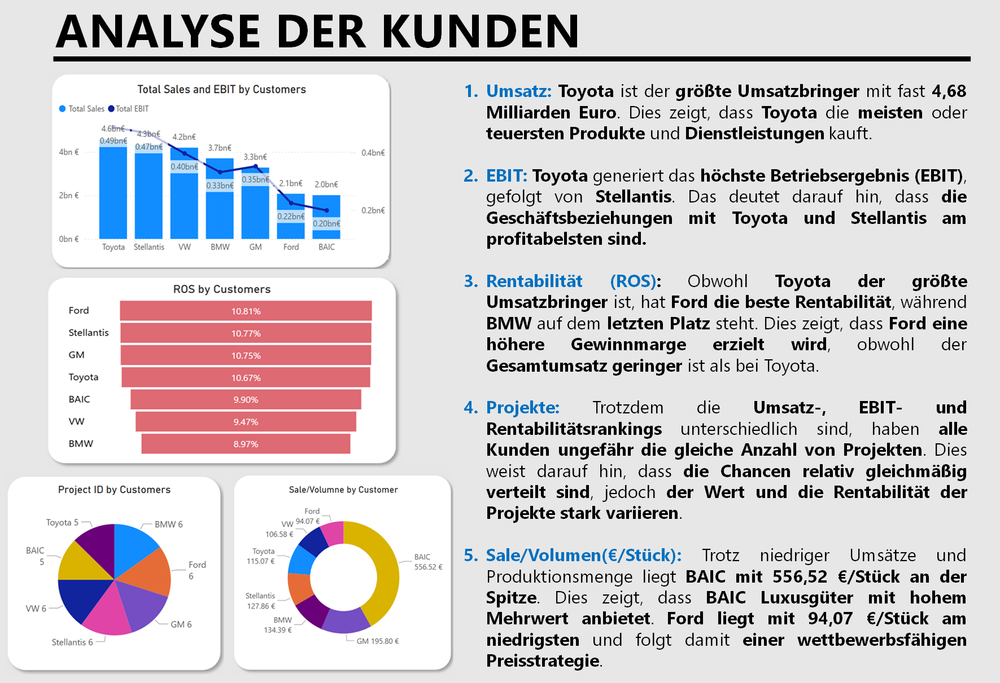

# Portfolio
# Business Intelligence in Controlling: Power BI Financial & Operational Dashboard

## 📌 Project Overview
This project was developed as part of the "Business Intelligence im Controlling" course. The goal was to build an interactive Power BI dashboard for an automotive supplier to analyze sales performance, profitability (EBIT, ROS), cost of materials, and plan vs. actual variances across multiple business units (Electronics, Battery, Mechanics).

## 🛠️ Tools & Technologies Used
* **Business Intelligence:** Microsoft Power BI, DAX, Power Query
* **Concepts:** Financial Controlling, Variance Analysis (Soll-Ist-Vergleich), Project Life-Cycle Costing, ETL/ELT Integration
* **Presentation:** Delivered final findings to corporate representatives.

## 📊 Key Insights & Controlling Recommendations
1. **Sales & EBIT Performance:** Electronics is the main revenue driver (~€12B Revenue, €1.5B EBIT). Mechanics shows low profitability (ROS < 5%), requiring cost structure optimization.
2. **Material Cost Analysis:** Over 50% of material costs originate from Electronics. High customer concentration risk in top 3 customers (Toyota, BAIC, GM).
3. **Plan vs. Actual Variance (2023–2024):** Actual sales exceeded target plans by ~5%. Material costs consistently exceeded budget, indicating a need for stricter procurement cost management.

## 📸 Dashboard Screenshots

## 📄 Full Project Presentation
You can view the full PDF presentation slides here: [Link to PDF](./BIC_PowerPoint_StA_Gruppe_4.pdf)

# Business Intelligence im Controlling: Power BI Performance-Analyse

Projektdokumentation einer Studienarbeit im Modul „Business Intelligence im Controlling“ (Gruppe von 4 Personen). 

Ziel des Projekts war die Analyse von Finanz- und Betriebsdaten eines Automobilzulieferers sowie die Erstellung eines interaktiven Power BI Dashboards zur Entscheidungsunterstützung des Managements. Die Ergebnisse und Handlungsempfehlungen wurden vor Unternehmensvertretern präsentiert.

## Key Insights & Controlling-Ergebnisse

### 1. Segment- & Produktleistung
* **Hauptumsatzträger:** Die Sparte *Electronics* dominiert das Ergebnis mit ca. 12 Mrd. € Umsatz und 1,5 Mrd. € EBIT.
* **Ertragsschwäche bei Mechanics:** Trotz 5 Mrd. € Umsatz erzielt *Mechanics* ein EBIT von unter 0,2 Mrd. € (ROS < 5 % bzw. im Ist-Vergleich teils negativ). Hier besteht dringender Restrukturierungsbedarf.
* **Projektlebenszyklus:** Die Daten zeigen ein Auslaufen der aktuellen Serienproduktion ab 2030 (End of Production). Eine frühzeitige Akquisition von OEM-Zukunftsprojekten ist essenziell.

### 2. Materialkosten & Kundenstruktur
* **Kostentreiber:** Über 50 % der Materialkosten entstehen im Bereich *Electronics*. Geografisch entfallen rund 50 % des Materialaufwands auf Asien.
* **Klumpenrisiko:** Die Top-3-Kunden (*Toyota, BAIC, GM*) verursachen über 50 % der gesamten Materialkosten.
* **Marge vs. Volumen:** *Toyota* liefert das höchste absolute EBIT, während *Ford* mit 10,81 % die höchste Umsatzrendite (ROS) erzielt.

### 3. Soll-Ist-Vergleich (Plan vs. Actual)
* **Sales:** Die Ist-Umsätze (*Act_Sales*) entwickelten sich positiv und lagen ca. 5 % über den Planwerten.
* **Materialkosten:** Die tatsächlichen Materialkosten (*Act_Mat*) lagen durchgehend über dem Budget (z. B. +4,11 % in 2023), was auf Handlungsbedarf im Beschaffungscontrolling hinweist.

## Dashboard Overview

*Abbildung 1:Executive Overview – Analyse von Umsatz, EBIT und Materialkosten nach Sparten.*

*Abbildung 2: Analyse von Umsatz, EBIT und Umsatzrendite (ROS) nach Kunden.*

*Abbildung 3: Abweichungsanalyse Plan vs. Ist für Umsatz und Materialaufwand.*

## Tech Stack & Methoden
* **Tools:** Microsoft Power BI, Power Query, DAX, MS PowerPoint
* **Methoden:** Variance Analysis (Soll-Ist-Vergleich), Deckungsbeitrags- & ROS-Analysen, Lifecycle Costing

## Dokumentation
* [Präsentationsfolien als PDF](./BIC_PowerPoint_StA_Gruppe_4.pdf)
